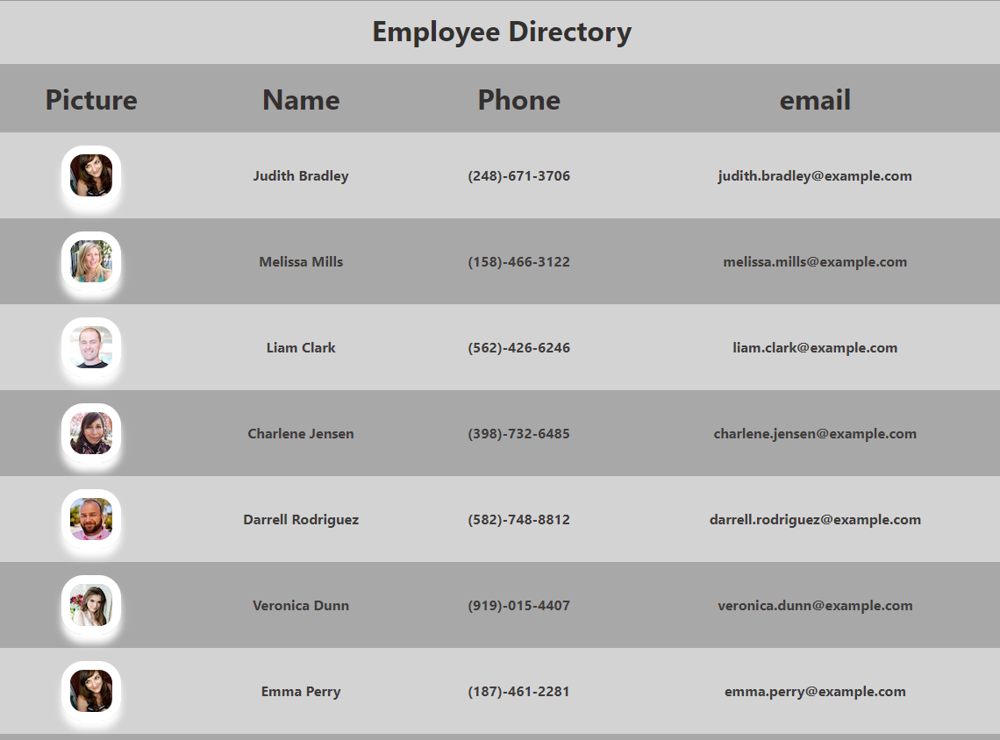

## Employee Directory

## Table Of Contents

- [Description](#description)
- [Challenges](#challenges)
- [Repository URL](#repository-URL)
- [Project URL](#project-URL)
- [Project Glimpse](#Project-Glimpse)
- [Credits](#credits)
- [License](#license)

## Description

An application that allows a company to view their entire employee directory with the employees information. This application uses React, Nodejs and npm packages such as Oxios, React Router and React Tables.

## Challenges

Being my first React project, I found there to be a lot of information to take in at one time. Specific challenges for me were the Axios API and React Tables.

## Repository URL

[Repository Link](https://github.com/chadclark1234/employee_directory)

## Project URL

[Project Link](https://chadclark1234.github.io/employee_directory/)

## Project Glimpse

## Credits

Special shout out to my classmates who helped me get through this one!

## License

NA
